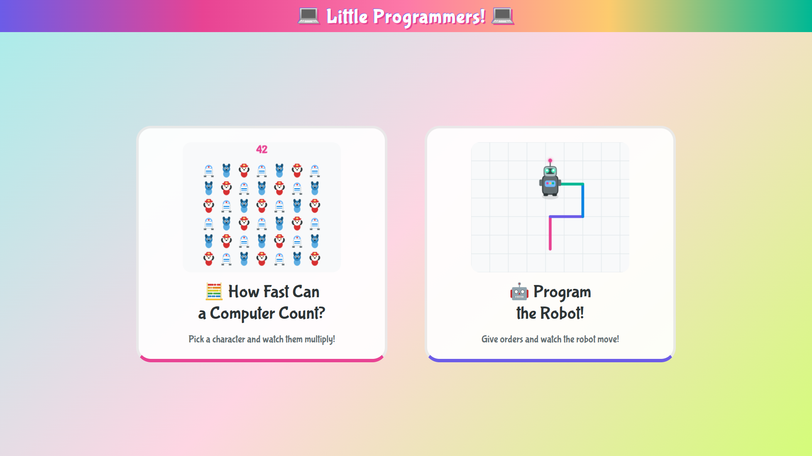

# Little Programmers!

A collection of interactive web demos for a 30-minute presentation to 4-5 year old kids,
explaining what a computer is and what programming means.

## The Presentation

1. **Hardware**: Show real hardware (laptop, small form factor desktop, Raspberry Pi) so kids see what a computer physically looks like.
2. **What computers do**: Interactive demos showing things computers are good at (counting, etc.).
3. **How we tell computers what to do**: A visual, Logo-inspired "robot programming" app where kids build a program out of colorful instruction blocks and watch a robot execute them.
4. **Kids become the robot**: All kids stand up and physically follow the same instructions — move forward, turn, jump, clap, sing — acting as the computer themselves.

## Demos

| File | Description |
|---|---|
| [`index.html`](index.html) | **Little Programmers!** — launcher page with two big illustrated cards linking to the demos below. |
| [`count.html`](count.html) | **How Fast Can a Computer Count?** — pick a character (R2D2, Bluey, Marshall), type a number (1-1000), and watch them fill the screen with accelerating speed. |
| [`robot.html`](robot.html) | **Program the Robot!** — a visual, Logo-inspired programming demo. See [design doc](docs/robot-app-design.md). |

## Running

All demos are static HTML files with zero dependencies.

**[Try it live!](https://ahachete.github.io/iamarobot/)** — or open `index.html` locally in a browser.
